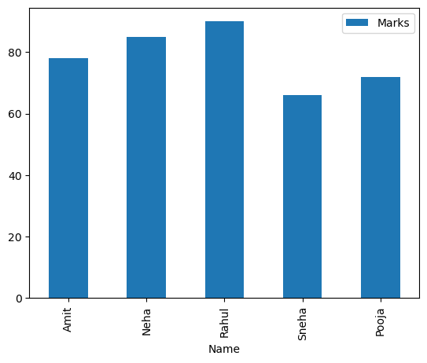
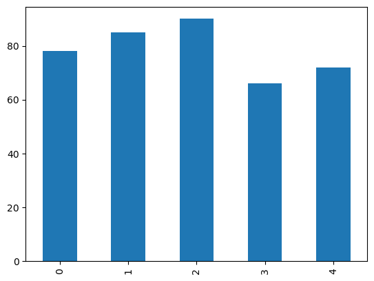
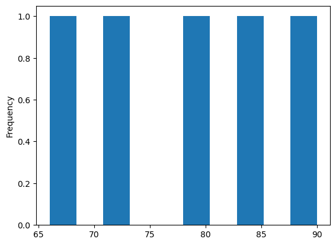
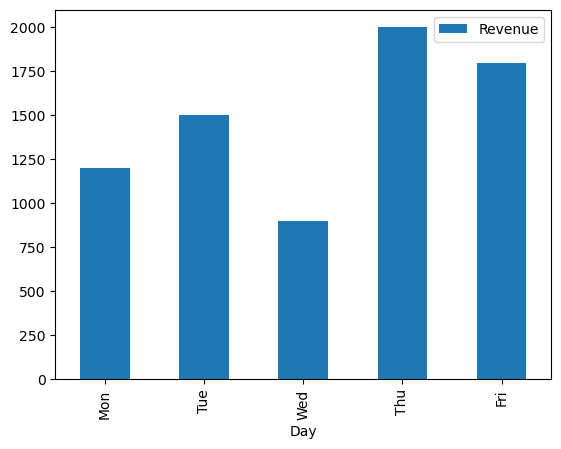

```python
# import pandas as pd

# print('Pandas version:', pd.__version__)
```

#### Task 1 : Pandas Series Basics


```python
import pandas as pd

marks = pd.Series([78,85,90,66,72])

# print values
marks


```


    0    78
    1    85
    2    90
    3    66
    4    72
    dtype: int64


```python
# print index
marks.index
```


    RangeIndex(start=0, stop=5, step=1)


```python
# print data type
marks.dtype

```


    dtype('int64')


```python

# access first element
marks[0]
```


    np.int64(78)


```python
# acess last two elemets
# print(marks[-2:])
marks.tail(2)
```


    3    66
    4    72
    dtype: int64


#### Task 2: Mathematical Operation on Series


```python
# 1. add 5 grace marks to all students
marks + 5

```


    0    83
    1    90
    2    95
    3    71
    4    77
    dtype: int64


```python

# 2. substract 2 marks from all values
marks - 2
```


    0    76
    1    83
    2    88
    3    64
    4    70
    dtype: int64


```python
# 3. Multiply all marks by 1.05
marks * 1.05
```


    0    81.90
    1    89.25
    2    94.50
    3    69.30
    4    75.60
    dtype: float64


```python
# 4. Divide all marks by 2
marks / 2
```


    0    39.0
    1    42.5
    2    45.0
    3    33.0
    4    36.0
    dtype: float64


#### Task 3: Python Functionalities on Series


```python
# 1. Find maximum marks
marks.max()
```


    90


```python
# Minimum msrks
marks.min()
```


    66


```python
# Sum of marks
marks.sum()
```


    np.int64(391)


```python
# Mean marks
marks.mean()
```


    np.float64(78.2)


```python
# 2. Apply a Lambda function to check weather each student has passed(>=70)
marks.apply(lambda x:x >=70)
```


    0     True
    1     True
    2     True
    3    False
    4     True
    dtype: bool


```python
# 3. Count how many students passed
(marks > 70).sum()
```


    np.int64(4)


#### Task 4: Create a DataFrame


```python
# Create a DataFrame students
students = {
    'Name':['Amit','Neha','Rahul','Sneha','Pooja'],
    'Marks':[78,85,90,66,72],
    'Subject':['Mth','Math','Science','Science','Math']
}
students
```


    {'Name': ['Amit', 'Neha', 'Rahul', 'Sneha', 'Pooja'],
     'Marks': [78, 85, 90, 66, 72],
     'Subject': ['Mth', 'Math', 'Science', 'Science', 'Math']}


```python
# 1. convert into DataFrame
students_df = pd.DataFrame(students)
students_df
```


<div>
<style scoped>
    .dataframe tbody tr th:only-of-type {
        vertical-align: middle;
    }

    .dataframe tbody tr th {
        vertical-align: top;
    }

    .dataframe thead th {
        text-align: right;
    }
</style>
<table border="1" class="dataframe">
  <thead>
    <tr style="text-align: right;">
      <th></th>
      <th>Name</th>
      <th>Marks</th>
      <th>Subject</th>
    </tr>
  </thead>
  <tbody>
    <tr>
      <th>0</th>
      <td>Amit</td>
      <td>78</td>
      <td>Mth</td>
    </tr>
    <tr>
      <th>1</th>
      <td>Neha</td>
      <td>85</td>
      <td>Math</td>
    </tr>
    <tr>
      <th>2</th>
      <td>Rahul</td>
      <td>90</td>
      <td>Science</td>
    </tr>
    <tr>
      <th>3</th>
      <td>Sneha</td>
      <td>66</td>
      <td>Science</td>
    </tr>
    <tr>
      <th>4</th>
      <td>Pooja</td>
      <td>72</td>
      <td>Math</td>
    </tr>
  </tbody>
</table>
</div>


```python
type(students_df)
```


    pandas.core.frame.DataFrame


```python
# 2. Print first rows
students_df.head(3)
```


<div>
<style scoped>
    .dataframe tbody tr th:only-of-type {
        vertical-align: middle;
    }

    .dataframe tbody tr th {
        vertical-align: top;
    }

    .dataframe thead th {
        text-align: right;
    }
</style>
<table border="1" class="dataframe">
  <thead>
    <tr style="text-align: right;">
      <th></th>
      <th>Name</th>
      <th>Marks</th>
      <th>Subject</th>
    </tr>
  </thead>
  <tbody>
    <tr>
      <th>0</th>
      <td>Amit</td>
      <td>78</td>
      <td>Mth</td>
    </tr>
    <tr>
      <th>1</th>
      <td>Neha</td>
      <td>85</td>
      <td>Math</td>
    </tr>
    <tr>
      <th>2</th>
      <td>Rahul</td>
      <td>90</td>
      <td>Science</td>
    </tr>
  </tbody>
</table>
</div>


```python
# 3. Print last 2 rows
students_df.tail(2)
```


<div>
<style scoped>
    .dataframe tbody tr th:only-of-type {
        vertical-align: middle;
    }

    .dataframe tbody tr th {
        vertical-align: top;
    }

    .dataframe thead th {
        text-align: right;
    }
</style>
<table border="1" class="dataframe">
  <thead>
    <tr style="text-align: right;">
      <th></th>
      <th>Name</th>
      <th>Marks</th>
      <th>Subject</th>
    </tr>
  </thead>
  <tbody>
    <tr>
      <th>3</th>
      <td>Sneha</td>
      <td>66</td>
      <td>Science</td>
    </tr>
    <tr>
      <th>4</th>
      <td>Pooja</td>
      <td>72</td>
      <td>Math</td>
    </tr>
  </tbody>
</table>
</div>


```python
# 4. Print DataFrame shape and column name
students_df.shape
```


    (5, 3)


```python
# Print DataFrame column name
students_df.columns
```


    Index(['Name', 'Marks', 'Subject'], dtype='object')


#### Task 5: Important DataFrame Functions


```python
# 1. use and output of .info()
students_df.info()
```

    <class 'pandas.core.frame.DataFrame'>
    RangeIndex: 5 entries, 0 to 4
    Data columns (total 3 columns):
     #   Column   Non-Null Count  Dtype 
    ---  ------   --------------  ----- 
     0   Name     5 non-null      object
     1   Marks    5 non-null      int64 
     2   Subject  5 non-null      object
    dtypes: int64(1), object(2)
    memory usage: 252.0+ bytes
    


```python
# use and output of .describe()
students_df.describe()
```


<div>
<style scoped>
    .dataframe tbody tr th:only-of-type {
        vertical-align: middle;
    }

    .dataframe tbody tr th {
        vertical-align: top;
    }

    .dataframe thead th {
        text-align: right;
    }
</style>
<table border="1" class="dataframe">
  <thead>
    <tr style="text-align: right;">
      <th></th>
      <th>Marks</th>
    </tr>
  </thead>
  <tbody>
    <tr>
      <th>count</th>
      <td>5.000000</td>
    </tr>
    <tr>
      <th>mean</th>
      <td>78.200000</td>
    </tr>
    <tr>
      <th>std</th>
      <td>9.654015</td>
    </tr>
    <tr>
      <th>min</th>
      <td>66.000000</td>
    </tr>
    <tr>
      <th>25%</th>
      <td>72.000000</td>
    </tr>
    <tr>
      <th>50%</th>
      <td>78.000000</td>
    </tr>
    <tr>
      <th>75%</th>
      <td>85.000000</td>
    </tr>
    <tr>
      <th>max</th>
      <td>90.000000</td>
    </tr>
  </tbody>
</table>
</div>


```python
# use and output of .head()
students_df.head()

```


<div>
<style scoped>
    .dataframe tbody tr th:only-of-type {
        vertical-align: middle;
    }

    .dataframe tbody tr th {
        vertical-align: top;
    }

    .dataframe thead th {
        text-align: right;
    }
</style>
<table border="1" class="dataframe">
  <thead>
    <tr style="text-align: right;">
      <th></th>
      <th>Name</th>
      <th>Marks</th>
      <th>Subject</th>
    </tr>
  </thead>
  <tbody>
    <tr>
      <th>0</th>
      <td>Amit</td>
      <td>78</td>
      <td>Mth</td>
    </tr>
    <tr>
      <th>1</th>
      <td>Neha</td>
      <td>85</td>
      <td>Math</td>
    </tr>
    <tr>
      <th>2</th>
      <td>Rahul</td>
      <td>90</td>
      <td>Science</td>
    </tr>
    <tr>
      <th>3</th>
      <td>Sneha</td>
      <td>66</td>
      <td>Science</td>
    </tr>
    <tr>
      <th>4</th>
      <td>Pooja</td>
      <td>72</td>
      <td>Math</td>
    </tr>
  </tbody>
</table>
</div>


```python
# use and output of .tail()
students_df.tail()
```


<div>
<style scoped>
    .dataframe tbody tr th:only-of-type {
        vertical-align: middle;
    }

    .dataframe tbody tr th {
        vertical-align: top;
    }

    .dataframe thead th {
        text-align: right;
    }
</style>
<table border="1" class="dataframe">
  <thead>
    <tr style="text-align: right;">
      <th></th>
      <th>Name</th>
      <th>Marks</th>
      <th>Subject</th>
    </tr>
  </thead>
  <tbody>
    <tr>
      <th>0</th>
      <td>Amit</td>
      <td>78</td>
      <td>Mth</td>
    </tr>
    <tr>
      <th>1</th>
      <td>Neha</td>
      <td>85</td>
      <td>Math</td>
    </tr>
    <tr>
      <th>2</th>
      <td>Rahul</td>
      <td>90</td>
      <td>Science</td>
    </tr>
    <tr>
      <th>3</th>
      <td>Sneha</td>
      <td>66</td>
      <td>Science</td>
    </tr>
    <tr>
      <th>4</th>
      <td>Pooja</td>
      <td>72</td>
      <td>Math</td>
    </tr>
  </tbody>
</table>
</div>


```python
# 2. Sort students marks in descending order
students_df.sort_values(by='Marks',ascending=False)
```


<div>
<style scoped>
    .dataframe tbody tr th:only-of-type {
        vertical-align: middle;
    }

    .dataframe tbody tr th {
        vertical-align: top;
    }

    .dataframe thead th {
        text-align: right;
    }
</style>
<table border="1" class="dataframe">
  <thead>
    <tr style="text-align: right;">
      <th></th>
      <th>Name</th>
      <th>Marks</th>
      <th>Subject</th>
    </tr>
  </thead>
  <tbody>
    <tr>
      <th>2</th>
      <td>Rahul</td>
      <td>90</td>
      <td>Science</td>
    </tr>
    <tr>
      <th>1</th>
      <td>Neha</td>
      <td>85</td>
      <td>Math</td>
    </tr>
    <tr>
      <th>0</th>
      <td>Amit</td>
      <td>78</td>
      <td>Mth</td>
    </tr>
    <tr>
      <th>4</th>
      <td>Pooja</td>
      <td>72</td>
      <td>Math</td>
    </tr>
    <tr>
      <th>3</th>
      <td>Sneha</td>
      <td>66</td>
      <td>Science</td>
    </tr>
  </tbody>
</table>
</div>


```python
# 3. reset index after sorting
students_df.sort_values(by='Marks', ascending=False).reset_index(drop=True)
```


<div>
<style scoped>
    .dataframe tbody tr th:only-of-type {
        vertical-align: middle;
    }

    .dataframe tbody tr th {
        vertical-align: top;
    }

    .dataframe thead th {
        text-align: right;
    }
</style>
<table border="1" class="dataframe">
  <thead>
    <tr style="text-align: right;">
      <th></th>
      <th>Name</th>
      <th>Marks</th>
      <th>Subject</th>
    </tr>
  </thead>
  <tbody>
    <tr>
      <th>0</th>
      <td>Rahul</td>
      <td>90</td>
      <td>Science</td>
    </tr>
    <tr>
      <th>1</th>
      <td>Neha</td>
      <td>85</td>
      <td>Math</td>
    </tr>
    <tr>
      <th>2</th>
      <td>Amit</td>
      <td>78</td>
      <td>Mth</td>
    </tr>
    <tr>
      <th>3</th>
      <td>Pooja</td>
      <td>72</td>
      <td>Math</td>
    </tr>
    <tr>
      <th>4</th>
      <td>Sneha</td>
      <td>66</td>
      <td>Science</td>
    </tr>
  </tbody>
</table>
</div>


#### Task 6: Filtering & Conditional Selection


```python
# 1. Students who scored more than 75 marks
students_df[students_df['Marks']>70]
```


<div>
<style scoped>
    .dataframe tbody tr th:only-of-type {
        vertical-align: middle;
    }

    .dataframe tbody tr th {
        vertical-align: top;
    }

    .dataframe thead th {
        text-align: right;
    }
</style>
<table border="1" class="dataframe">
  <thead>
    <tr style="text-align: right;">
      <th></th>
      <th>Name</th>
      <th>Marks</th>
      <th>Subject</th>
    </tr>
  </thead>
  <tbody>
    <tr>
      <th>0</th>
      <td>Amit</td>
      <td>78</td>
      <td>Mth</td>
    </tr>
    <tr>
      <th>1</th>
      <td>Neha</td>
      <td>85</td>
      <td>Math</td>
    </tr>
    <tr>
      <th>2</th>
      <td>Rahul</td>
      <td>90</td>
      <td>Science</td>
    </tr>
    <tr>
      <th>4</th>
      <td>Pooja</td>
      <td>72</td>
      <td>Math</td>
    </tr>
  </tbody>
</table>
</div>


```python
#  2. Student belonging to subject Math
students_df[students_df['Subject']=='Math']
```


<div>
<style scoped>
    .dataframe tbody tr th:only-of-type {
        vertical-align: middle;
    }

    .dataframe tbody tr th {
        vertical-align: top;
    }

    .dataframe thead th {
        text-align: right;
    }
</style>
<table border="1" class="dataframe">
  <thead>
    <tr style="text-align: right;">
      <th></th>
      <th>Name</th>
      <th>Marks</th>
      <th>Subject</th>
    </tr>
  </thead>
  <tbody>
    <tr>
      <th>1</th>
      <td>Neha</td>
      <td>85</td>
      <td>Math</td>
    </tr>
    <tr>
      <th>4</th>
      <td>Pooja</td>
      <td>72</td>
      <td>Math</td>
    </tr>
  </tbody>
</table>
</div>


```python
# 3. Students who score more than average marks
students_df[students_df['Marks']>students_df['Marks'].mean()]
```


<div>
<style scoped>
    .dataframe tbody tr th:only-of-type {
        vertical-align: middle;
    }

    .dataframe tbody tr th {
        vertical-align: top;
    }

    .dataframe thead th {
        text-align: right;
    }
</style>
<table border="1" class="dataframe">
  <thead>
    <tr style="text-align: right;">
      <th></th>
      <th>Name</th>
      <th>Marks</th>
      <th>Subject</th>
    </tr>
  </thead>
  <tbody>
    <tr>
      <th>1</th>
      <td>Neha</td>
      <td>85</td>
      <td>Math</td>
    </tr>
    <tr>
      <th>2</th>
      <td>Rahul</td>
      <td>90</td>
      <td>Science</td>
    </tr>
  </tbody>
</table>
</div>


```python
# 4. Students who failed (marks <70)
students_df[students_df['Marks']<70]
```


<div>
<style scoped>
    .dataframe tbody tr th:only-of-type {
        vertical-align: middle;
    }

    .dataframe tbody tr th {
        vertical-align: top;
    }

    .dataframe thead th {
        text-align: right;
    }
</style>
<table border="1" class="dataframe">
  <thead>
    <tr style="text-align: right;">
      <th></th>
      <th>Name</th>
      <th>Marks</th>
      <th>Subject</th>
    </tr>
  </thead>
  <tbody>
    <tr>
      <th>3</th>
      <td>Sneha</td>
      <td>66</td>
      <td>Science</td>
    </tr>
  </tbody>
</table>
</div>


#### Task 7: Grouping and Basic Analysis


```python
# 1. Find average marks per subject using groupby()
students_df.groupby('Subject')['Marks'].mean()
```


    Subject
    Math       78.5
    Mth        78.0
    Science    78.0
    Name: Marks, dtype: float64


```python
# 2. Count number of students per subject
students_df.groupby('Subject').size()
```


    Subject
    Math       2
    Mth        1
    Science    2
    dtype: int64


```python
# 3. Find maximum marks per subject
students_df.groupby('Subject')['Marks'].max()
```


    Subject
    Math       85
    Mth        78
    Science    90
    Name: Marks, dtype: int64


#### Task 8: Panda Plotting(Simple Graphs)


```python
# Plot a bar graph of students name and marks
students_df.plot(x='Name',y='Marks',kind='bar')
```


    <Axes: xlabel='Name'>


    

    


```python
# 2. Plot aline graph of marks
students_df['Marks'].plot(kind='bar')
```


    <Axes: >


    

    


```python
# 3. Plot a Histogram of marks
students_df['Marks'].plot(kind='hist')
```


    <Axes: ylabel='Frequency'>


    

    


#### Task 9: Mini Use Case: Sales Data Analysis


```python
# create a DataFrame
sales = {
    'Day':['Mon','Tue','Wed','Thu','Fri'],
    'Revenue':[1200,1500,900,2000,1800]
}
sales_df = pd.DataFrame(sales)
sales_df
```


<div>
<style scoped>
    .dataframe tbody tr th:only-of-type {
        vertical-align: middle;
    }

    .dataframe tbody tr th {
        vertical-align: top;
    }

    .dataframe thead th {
        text-align: right;
    }
</style>
<table border="1" class="dataframe">
  <thead>
    <tr style="text-align: right;">
      <th></th>
      <th>Day</th>
      <th>Revenue</th>
    </tr>
  </thead>
  <tbody>
    <tr>
      <th>0</th>
      <td>Mon</td>
      <td>1200</td>
    </tr>
    <tr>
      <th>1</th>
      <td>Tue</td>
      <td>1500</td>
    </tr>
    <tr>
      <th>2</th>
      <td>Wed</td>
      <td>900</td>
    </tr>
    <tr>
      <th>3</th>
      <td>Thu</td>
      <td>2000</td>
    </tr>
    <tr>
      <th>4</th>
      <td>Fri</td>
      <td>1800</td>
    </tr>
  </tbody>
</table>
</div>


```python
# 1. Total revenue
sales_df['Revenue'].sum()
```


    np.int64(7400)


```python
# 2. Average Daily Revenue
sales_df['Revenue'].mean()
```


    np.float64(1480.0)


```python
# 3. Day with highest revenue
sales_df.loc[sales_df['Revenue'].idxmax()]
```


    Day         Thu
    Revenue    2000
    Name: 3, dtype: object


```python
# 4. Days where revenue > average
sales_df.loc[sales_df['Revenue'] > sales_df['Revenue'].mean(),'Day']
```


    1    Tue
    3    Thu
    4    Fri
    Name: Day, dtype: object


```python
sales_df.plot(x='Day',y='Revenue',kind='bar')
```


    <Axes: xlabel='Day'>


    

    

